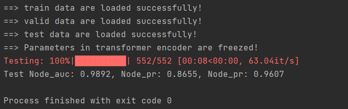

# Multi-AD

This repository contains the code implementation of Multi-AD for graph anomlay detection. 

## Dataset Sources
- The sources and usage of the [Amazon](https://docs.dgl.ai/en/latest/generated/dgl.data.FraudAmazonDataset.html#dgl.data.FraudAmazonDataset) and [YelpChi](https://docs.dgl.ai/en/latest/generated/dgl.data.FraudYelpDataset.html#dgl.data.FraudYelpDataset) datasets can be found in `dgl.data`; 
- The sources of the [Weibo](https://drive.google.com/file/d/1txzXrzwBBAOEATXmfKzMUUKaXh6PJeR1/edit) and [T-Finance](https://drive.google.com/file/d/1txzXrzwBBAOEATXmfKzMUUKaXh6PJeR1/edit) datasets can be obtained from [''GADBench: Revisiting and Benchmarking Supervised Graph Anomaly Detection''](https://arxiv.org/abs/2306.12251); 
- The source and usage of the [Elliptic](https://www.kaggle.com/datasets/ellipticco/elliptic-data-set) dataset can be found on the `kaggle.com`.

Place the obtained datasets into the `./datasets` folder for subsequent testing and training.


## Installation
Ensure you have `Python=3.10` and `PyTorch=1.13.1` installed on your system. You can install the required packages using the following command:

```python
pip install -r requirements.txt
```

## Preparing Data
Before training the model, you need to preprocess the data. The `preprocess.py` is designed to handle this step. Run the script as follows:
```python
python preprocess.py
```

This script will process the raw data and prepare it for training and testing.

## Model Training
To train the Multi-AD model, set the mode argument to train and run the `main.py` script:
```python
python main.py --mode train
```

Ensure you have configured the necessary parameters and data paths in the script or through a configuration file.

## Model Testing
After training the model, you can test its performance by setting the mode argument to test and running the `main.py` script:
```python
python main.py --mode test
```

This will evaluate the trained model on your test dataset and provide performance metrics.

## Result
The following shows the test results of the Weibo dataset:



